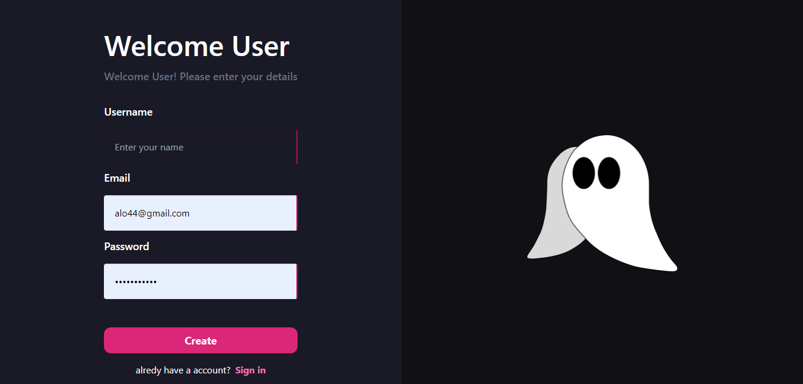
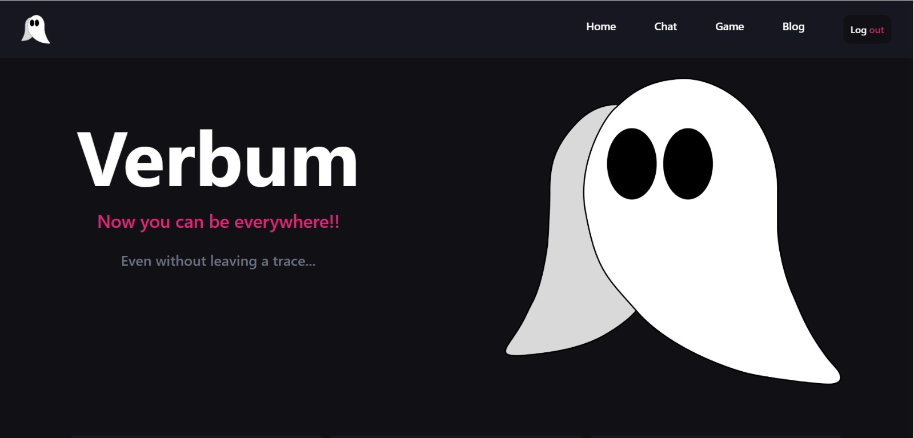
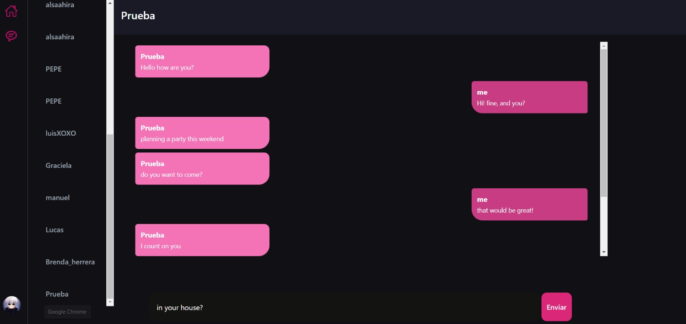
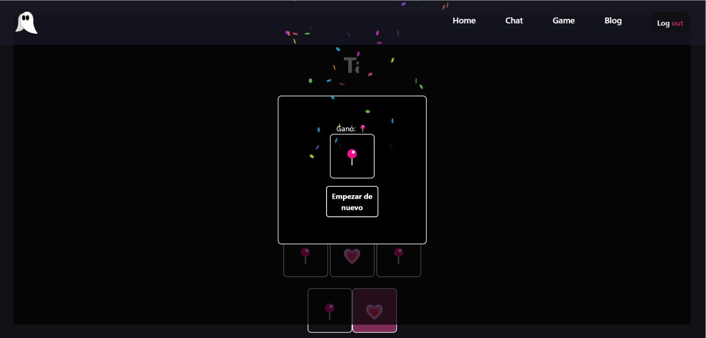
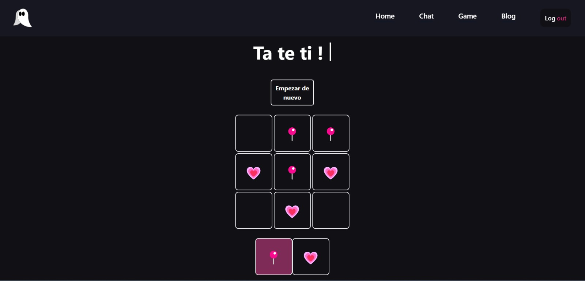
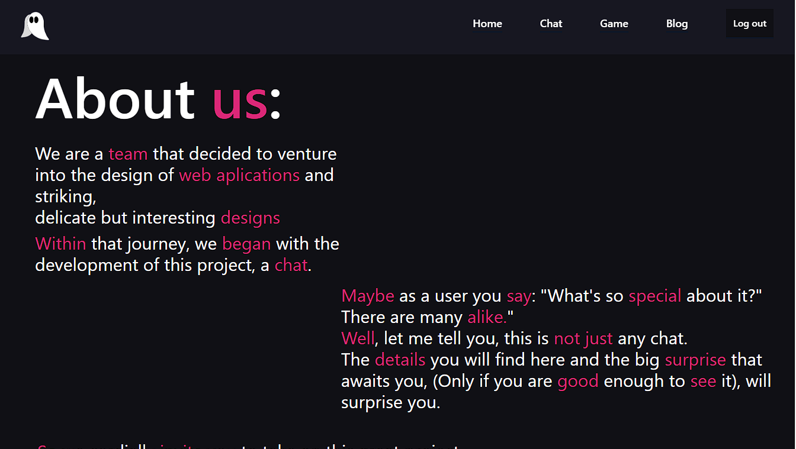
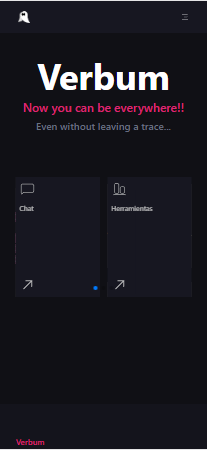
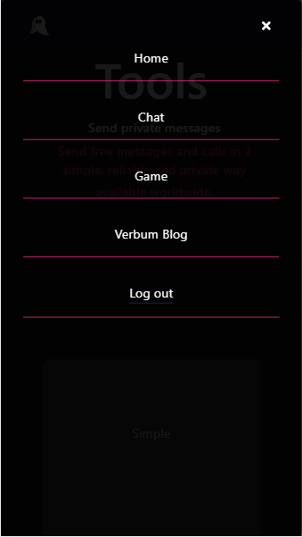

# Verbum - Chat

This is our chat project, Verbum, as a task for SomosCoders.

## Overview

### As a user I am looking for:

- All parts of the page can be entered correctly.
- Navigate correctly without redirecting me to the wrong place.
- Being able to interact with the elements of the page without any problem.
- Be able to save my registration to the page.
- That you have something more interesting to offer.


### Views:













### technologies

- React 
- Typescript
- Node Js
- Tailwind css
- Socket.io
- JsonWebToken
- Jest
- Axios
- Vite
- Express 
- Dotenv


### Installation Manual

1. Clone the repository:
```
 https://github.com/AlooNDRaa/Verbum.git

```

2. Navigate to the project directory:
```
cd frontend/chat
``` 

3. Install dependencies:
```
npm i
``` 

4. Start the app:
```
npm run dev
``` 

5. Repeat the previous instructions but with the backend folder:
```
cd backend/servidor-express
npm i
npm start

``` 


## Authors

- Github - [BrendaRuthHerrera](https://github.com/BrendaRuthHerrera)
- Github - [AlooNDRaa](https://github.com/AlooNDRaa)
- Github - [Arleth-cordero20](https://github.com/Arleth-cordero20)
- Github - [Ysluna](https://github.com/Ysluna)


-------------

# Verbum - Chat

Este es nuestro proyecto de chat, Verbum, como una tarea para SomosCoders.

## Overview

### Como usuario estoy buscando:

- Se pueda ingresar correctamente a todas las partes de la pagina.
- Navegar correctamente sin redirigirme a un lugar incorrecto.
- Poder interactuar con los elementos de la página sin ningún problema.
- Poder guardar mi registro a la página.
- Que tenga algo más interesante que ofrecer.

### Vistas:


### Tecnologías

- React 
- Typescript
- Node Js
- Tailwind css
- Socket.io
- JsonWebToken
- Jest
- Axios
- Vite
- Express 
- Dotenv

### Installation Manual

1. Clonar el repositorio:
```
 https://github.com/AlooNDRaa/Verbum.git

```

2. Navegar a la carpeta del proyecto:
```
cd frontend/chat
``` 

3. Instalar las dependencias:
```
npm i
``` 

4. Correr la applicación:
```
npm run dev
``` 

5. Repetir los pasos con la otra carpeta:
```
cd backend/servidor-express
npm i
npm start

``` 

## Autores

- Github - [BrendaRuthHerrera](https://github.com/BrendaRuthHerrera)
- Github - [AlooNDRaa](https://github.com/AlooNDRaa)
- Github - [Arleth-cordero20](https://github.com/Arleth-cordero20)
- Github - [Ysluna](https://github.com/Ysluna)
