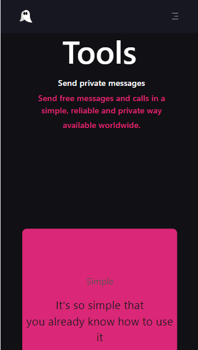

# Verbum - Chat

It all starts with a Verbum, Our first chat project as a Somos Coders task.

## Overview

### As a user I am looking for:

- All parts of the page can be entered correctly.
- Navigate correctly without redirecting me to the wrong place.
- Being able to interact with the elements of the page without any problem.

### Views:

### technologies

- React 
- Typescript
- Node Js
- Tailwind css
- Jest
- Axios
- Vite
- Express 
- Dotenv

### Installation Manual

## Authors

- Github - [BrendaRuthHerrera](https://github.com/BrendaRuthHerrera)
- Github - [AlooNDRaa](https://github.com/AlooNDRaa)
- Github - [Arleth-cordero20](https://github.com/Arleth-cordero20)
- Github - [Ysluna](https://github.com/Ysluna)

-------------

# Verbum - Chat

Todo comienza con un Verbum, Nuestro primer proyecto de chat como tarea de Somos Coders.

## Overview

### Como usuario estoy buscando:

- Se pueda ingresar correctamente a todas las partes de la pagina.
- Navegar correctamente sin redirigirme a un lugar incorrecto.
- Poder interactuar con los elementos de la página sin ningún problema.

### Vistas:

### Tecnologías

- React 
- Typescript
- Node Js
- Tailwind css
- Jest
- Axios
- Vite
- Express 
- Dotenv

### Installation Manual

## Autores

- Github - [BrendaRuthHerrera](https://github.com/BrendaRuthHerrera)
- Github - [AlooNDRaa](https://github.com/AlooNDRaa)
- Github - [Arleth-cordero20](https://github.com/Arleth-cordero20)
- Github - [Ysluna](https://github.com/Ysluna)
